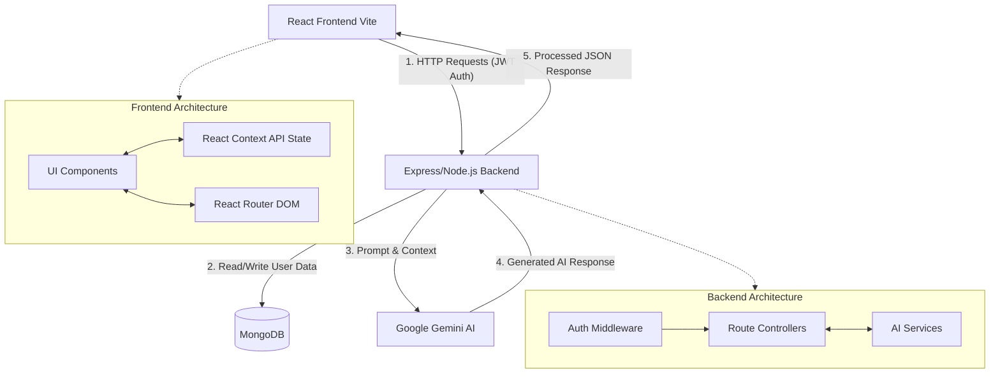

# AI Interview Agent - MERN Stack

An intelligent, full-stack application that acts as a comprehensive AI Career Assistant. It provides mock interviews, resume enhancement, career coaching, and skill assessment quizzes using Google's Gemini AI.

## 🚀 Features

- **AI Mock Interviews:** Conducts dynamic, real-time interviews with follow-up questions tailored to the user's resume and job role. Evaluates answers out of 10 and provides actionable feedback.
- **Webcam Proctoring:** Uses advanced tracking to ensure interview integrity (detects looking away, multiple faces, cell phones, etc.).
- **Resume Enhancer:** Analyzes uploaded resumes against job descriptions, returning an ATS score, matched/missing keywords, and a completely rewritten, optimized resume.
- **Career Chatbot:** A conversational AI coach that provides career advice, interview tips, and answers professional development questions.
- **Skill Quizzes:** Generates custom multiple-choice quizzes for any given topic to help users assess and improve their knowledge.

## 🏗️ Architecture & Data Flow

The application follows a standard MERN stack architecture with a highly decoupled frontend and backend. The backend acts as an orchestration layer, securely handling authentication and communicating with the Gemini AI model.



## 💻 Technology Stack

**Frontend:**
- React (Vite)
- Vanilla CSS (Glassmorphism & Modern UI)
- React Router DOM
- React Webcam (for Proctoring)
- Lucide React (Icons)

**Backend:**
- Node.js & Express
- MongoDB (Mongoose)
- Google Generative AI SDK (`@google/generative-ai`)
- JSON Web Tokens (JWT) for Authentication
- Bcrypt.js (Password Hashing)
- Multer (File Uploads)
- PDF-Parse (Resume Text Extraction)

## 🛠️ Local Development Setup

1. **Clone the repository:**
   ```bash
   git clone <your-repo-url>
   cd "AI Interview Agent - MERN Stack"
   ```

2. **Setup the Backend:**
   ```bash
   cd backend
   npm install
   ```
   Create a `.env` file in the `backend` directory:
   ```env
   PORT=5000
   MONGO_URI=your_mongodb_connection_string
   JWT_SECRET=your_jwt_secret
   GEMINI_API_KEY=your_google_gemini_api_key
   ```
   Start the backend:
   ```bash
   npm run dev
   ```

3. **Setup the Frontend:**
   ```bash
   cd ../frontend
   npm install
   ```
   Start the frontend:
   ```bash
   npm run dev
   ```

4. Open your browser and navigate to `http://localhost:3002`.

## 🌐 Deployment (Production)

This project is configured for a split-deployment architecture to prevent serverless timeout limits during heavy AI operations.
- **Frontend:** Deploy on Vercel. Set the `VITE_API_URL` environment variable to point to your backend.
- **Backend:** Deploy on Render.com (or Railway) as a Web Service to allow for long-running AI generation requests.
